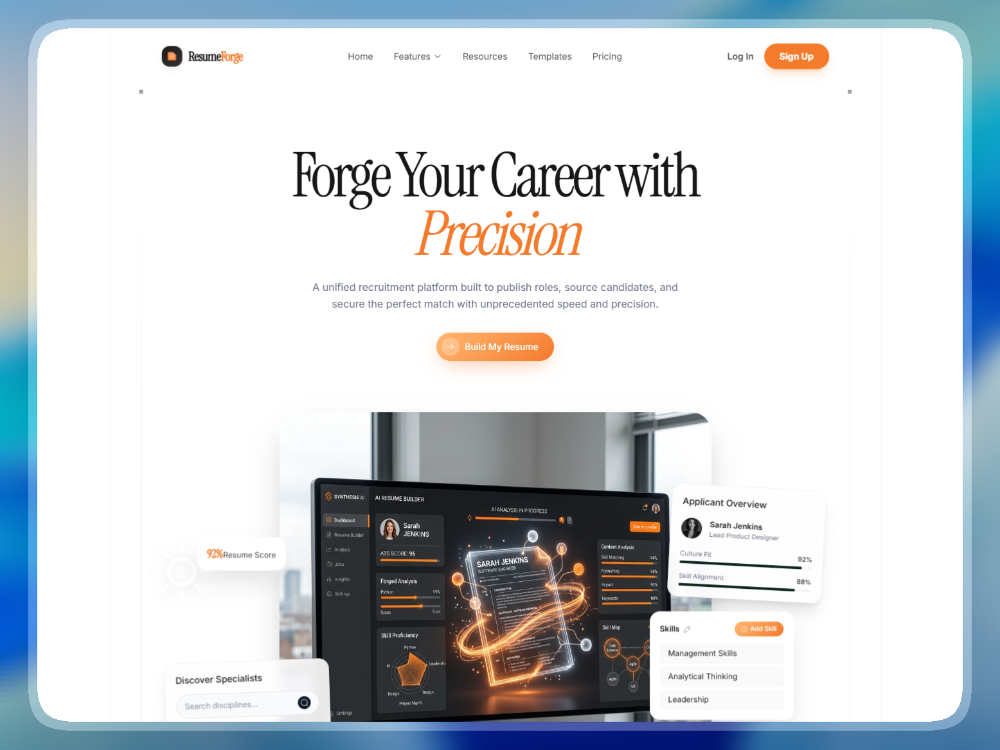

# 🚀 Forger Landing Page
> **Day 8/30 of the "Building 1 AI-Generated Landing Page Every Day" Challenge**



## 🚀 About

Conceptual landing page for **Forger**, an **AI-powered recruitment platform**, developed with **Next.js 16**, **TypeScript**, and **Tailwind CSS 4**. This project is the seventh realization of an ambitious challenge: creating **1 complete and functional mockup per day using AI**.

Forger is a unified recruitment platform built to publish roles, source candidates, and secure the perfect match with unprecedented speed and precision. The goal is to convey **professionalism**, **data-driven intelligence**, and **recruitment excellence** through a high-end, precise design aesthetic.

Live URL: [https://forger-landing.adrielzimbril.com](https://forger-landing.adrielzimbril.com)

## 🎨 Design & Aesthetic Decisions (The "Why")

For this seventh day, the chosen theme revolves around **AI-driven recruitment, talent acquisition, and career performance tracking**.

- **Industrial Workbench Aesthetic:** The interface relies on rigid geometry, hairline borders, and a clean white canvas to feel like a high-performance professional tool.
- **Forged Energy Accents:** 'Forged Orange' (#F47A2C) is used for primary calls to action and critical highlights, representing the "spark" of a successful match.
- **Data-Driven Clarity:** The design balances institutional trust with modern technical depth, using technical grids and semi-pill shaped status badges.
- **Purposeful Interaction:** Product cards simulate candidate screening, market analysis dashboards, and talent sourcing workflows.
- **Serif Elegance:** Instrument Serif and Fraunces provide a sophisticated, authoritative tone for headings, balanced by Inter's functional readability.

## 🧩 Key Sections

- **🌟 Precision Hero:** A high-impact entry point featuring "Forge Your Next Match with Precision" with smooth GSAP reveal animations.
- **🧠 Career Performance:** A metrics-focused section showcasing system reliability and talent matching success rates.
- **📊 Recruitment Dashboard:** Simulates a real-time market analysis and talent pool overview with interactive-feeling UI elements.
- **🔍 Talent Sourcing:** Dedicated components for discovering specialists and managing applicant overviews.
- **⚡ AI-Powered Interview:** Showcases how the platform automates and optimizes the initial screening process.
- **🏢 Modern Footer:** A comprehensive site map with a secondary "Forge your career" call to action.

## 🛠️ Tech Stack

This mockup was built with cutting-edge technologies from the React ecosystem:

- **[Next.js 16](https://nextjs.org/)** (App Router)
- **[React 19](https://react.dev/)**
- **TypeScript** for scalable component architecture and safer iteration.
- **[Tailwind CSS v4](https://tailwindcss.com/)** for design tokens, utilities, and modern CSS support.
- **[Motion/React](https://motion.dev/)** (formerly Framer Motion) and **GSAP** for high-performance animations and transitions.
- **[Iconify](https://icon-sets.iconify.design/)** (Solar icons) for consistent, technical iconography.
- **Next Font** with **Instrument Serif**, **Fraunces**, and **Inter** for optimized typography.

## 🚀 Quick Start

```bash
# Install dependencies
pnpm install

# Run development server
pnpm dev
```

Open [http://localhost:3000](http://localhost:3000) in your browser to see the result.

## 🌌 Let's meet in space (or on Earth) 🚀

I'm always happy to discuss new projects, collaborations, or simply exchange creative ideas. Here's how to contact me:

- **📧 Email**: [hello@adrielzimbril.com](mailto:hello@adrielzimbril.com)
- **🌐 Website**: [https://www.adrielzimbril.com](https://www.adrielzimbril.com)
- **🐦 Twitter**: [https://twitter.com/adrielzimbril](https://twitter.com/adrielzimbril)
- **💼 LinkedIn**: [https://www.linkedin.com/in/adrielzimbrilcode](https://www.linkedin.com/in/adrielzimbrilcode)
- **🐼 GitHub**: [https://github.com/adrielzimbril](https://github.com/adrielzimbril)

### 🐼 Fun Facts

- 🚀 Passionate about space exploration and technology
- 🐼 Love pandas (and animals in general!)
- 🎨 Creative at heart, whether in design or code
- ☕ Addicted to coffee and complex technical challenges

## 🌟 Join the Adventure

If you like this project, feel free to:

- ⭐ Star the project
- 🐞 Report bugs
- ✨ Suggest improvements
- 🚀 Share with other enthusiasts

## 💖 Support the Project

If you find this project useful and would like to support its development, you can do so through these platforms:

- [](https://go.adrielzimbril.com/gs)

## 🌐 Hosting

This project is 100% hosted on modern cloud infrastructure for maximum performance and reliability:

- [](https://vercel.com)

## 📄 License

This project is under the MIT license. Feel free to use it as a base for your own portfolio or project.

---

**Developed with ❤️ by Adriel Zimbril**  
_Product Designer & Fullstack Developer_  
🚀 Digital Universe Explorer | 🐼 Panda Friend | 🎨 Passionate Creator
